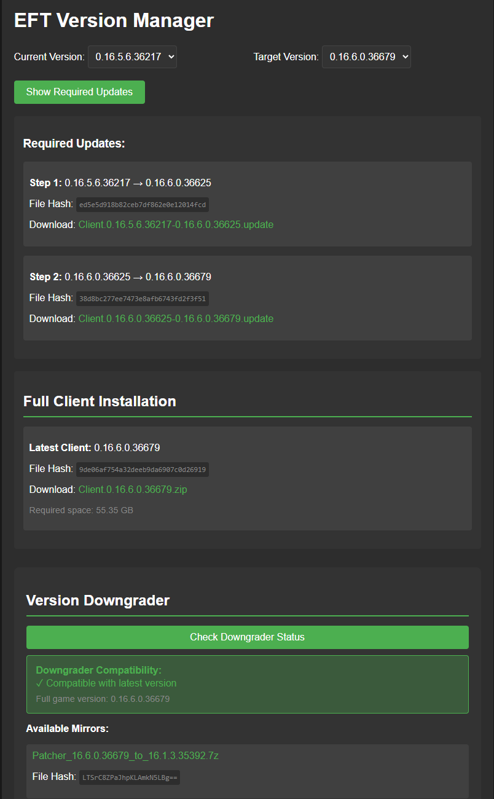

# EFT Version Manager

# The project is on hold, I don't have time to maintain the project for now.

A web-based version management utility for Escape from Tarkov, providing version tracking, update paths, and downgrade capabilities.



## Features

- 🔄 Update path calculation between versions
- ⏪ Downgrade compatibility checking
- 📦 Mirror links for patcher files
- ⚡ Cached API responses for reduced server load
- 🛡️ Rate limiting and error handling

## Prerequisites

- Node.js v16+
- npm v7+
- EFT launcher Bearer Token

## Installation

1. Clone the repository:
```bash
git clone https://github.com/cocorico8/eftvm.git
cd eftvm
```

2. Install dependencies:
```bash
npm install
```

3. Create `.env` file:
```env
BEARER_TOKEN=your_launcher_token_here
CACHE_TTL=300000  # 5 minutes
PORT=3000
```

4. Start the server:
```bash
node server.js
```

The web interface will be available at `http://localhost:3000`

## Configuration

| Environment Variable | Description                                  | Default       |
|----------------------|----------------------------------------------|---------------|
| BEARER_TOKEN         | EFT Launcher API bearer token (Required)     | -             |
| CACHE_TTL            | API response cache duration in milliseconds  | 300000 (5min) |
| PORT                 | Server port                                  | 3000          |

## Usage

### Web Interface
1. Access the web interface at `http://localhost:3000`
2. Select current and target versions
3. View required update path and download links

### Downgrade Compatibility
1. Click "Check Downgrader Status"
2. View compatibility with current game version
3. Access mirror links for patcher files

### Cache Management
- Cached responses automatically refresh based on TTL
- Cache persists through server restarts via `cache.json`
- Invalid entries automatically pruned

## Development

### Tech Stack
- Backend: Node.js/Express
- Frontend: Vanilla JS/HTML/CSS
- Logging: Winston with daily rotation
- Caching: In-memory + disk persistence

### Contributing
1. Fork the repository
2. Create a new branch
3. Submit a pull request

Please follow existing code style and include tests where applicable.

---

**Disclaimer**: This project is not affiliated with Battlestate Games. Use at your own risk.
